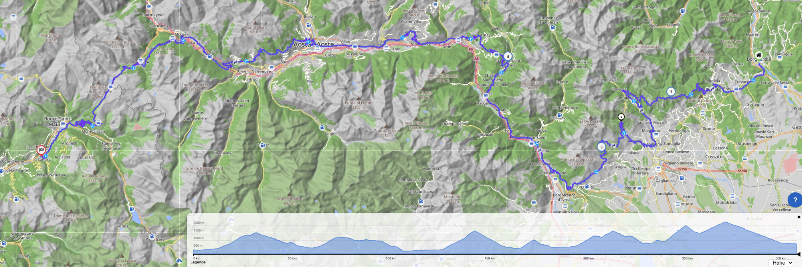
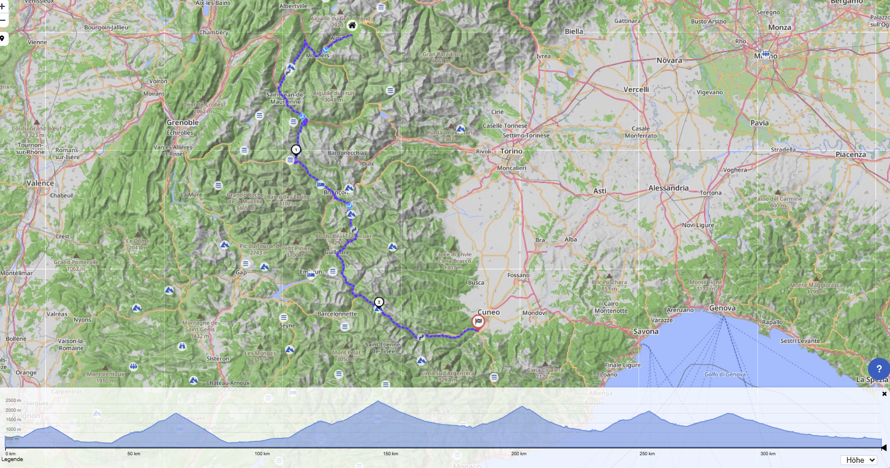
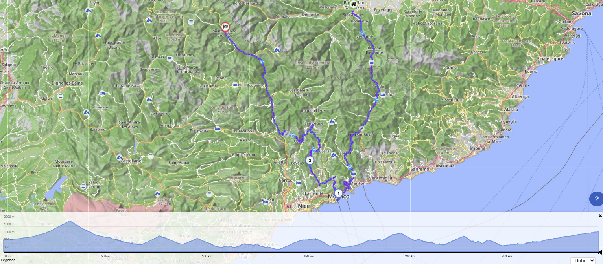
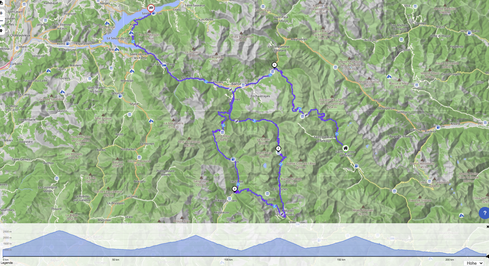
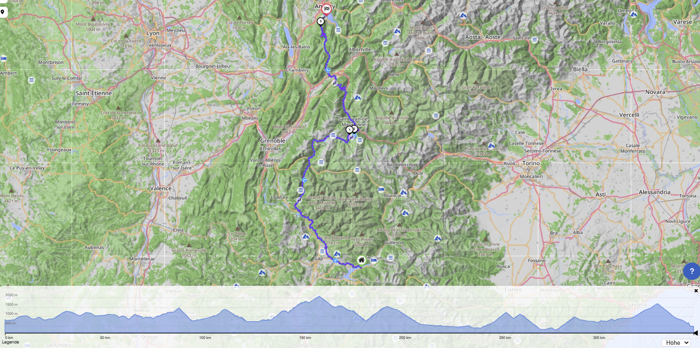
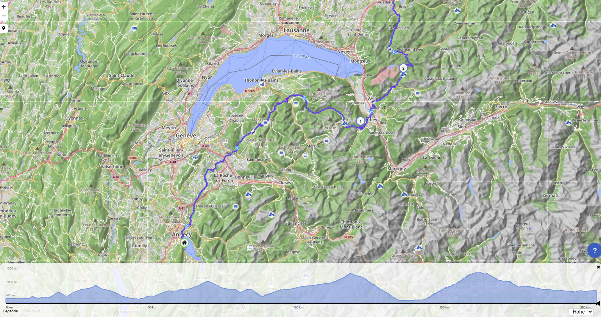

# Motorradtour ITA - FRA - MCO

🡹🡻🡺🡸

<b>Tag 0: Start in Borgosesia</b>

Unterkunft noch suchen

<b>Tag 1: Borgosesia - Landry</b>

### Stats

* 307km
* 6h 23min
* 🡹 12526m 🡻 12143m

### Route

### Unterkunft
[Camping Eden de la Vanoise](https://www.camping-eden-savoie.com/de/camping-sommerberg/)

| Adresse                                                           | Kontakt                      |
| ----------------------------------------------------------------- | ---------------------------- |
| [170, Route du Perrey](https://maps.app.goo.gl/fLBdP6ijpk3ppwbj8) | Tel: +33 4 79 07 61 81       |
| 73210 Landry                                                      | Mail: campingleden@gmail.com |

<b>Tag 2: Landry - Borgo San Dalmazzo (eigentlich Cuneo)</b>

### Stats

* 343km
* 6h 38min
* up 12627m / down 12783m

### Route

### Unterkunft

[Campeggio Bisalta](https://www.cuneocamp.it/en/)

| Adresse                                                           | Kontakt                        |
| ----------------------------------------------------------------- | ------------------------------ |
| [Via San Maurizio, 33](https://maps.app.goo.gl/LvpGy8ME2jd5kdQd8) | Tel: 0171 491334               |
| 12100 Cuneo                                                       | Mail: campingbisalta@libero.it |

<b>Tag 3: Borgo San Dalmazzo - Saint-Étienne-de-Tinée</b>

Mit Halt in Monaco

### Stats

* 295km
* 6h 11min
* up 14498m / down 13972m

### Route

### Unterkunft

[Camping du plan d'eau](https://campingduplandeau.com/)

| Adresse     | Kontakt |
| ----------- | ------- |
| [Cartel](https://maps.app.goo.gl/afqh965Li4bKvABV7) | Tel: 04.93.02.41.57   |
| 06660 Saint-Étienne-de-Tinée     | Mail:   |

<b>Tag 4: Saint-Étienne-de-Tinée - Savines-le-Lac</b>

Höchster durchgehender, asphaltierter Alpenpass Europas

### Stats

* 216km
* 4h 2min
* up 9727m / down 10085m

### Route

### Unterkunft

[Camping à Savines-le-Lac](https://www.hotel-les-sources.com/fr/camping-savines-lac)

| Adresse     | Kontakt |
| ----------- | ------- |
| [6 Rue des Chaumettes](https://maps.app.goo.gl/yavSmWHkdJpKzM8i9) | Tel: +33492442052   |
| 05160 Savines-le-Lac     | Mail:   |

<b>Tag 5: Savines-le-lac - Sevrier</b>

### Stats

* 346km
* 6h 39min
* up 13039m / down 13399m

### Route

### Unterkunft

[Camping au Cœur du Lac](https://www.camping-annecy-sevrier.fr/)

| Adresse     | Kontakt |
| ----------- | ------- |
| [3233 Route d’Albertville](https://maps.app.goo.gl/dr9trFTXimS9c9Gr5) | Tel: +33(0)7.44.79.97.43  |
| 74320 Sévrier     | Mail:   |

<b>Tag 6: Sevrier - Bulle</b>

### Stats

* 203km
* 4h 38min
* up 6303m / down 5991m

### Route

